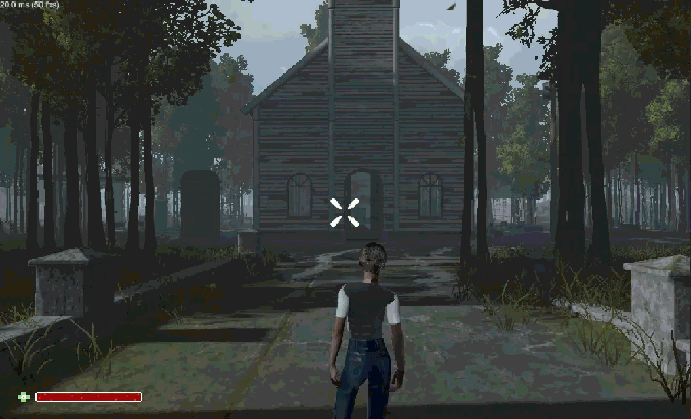
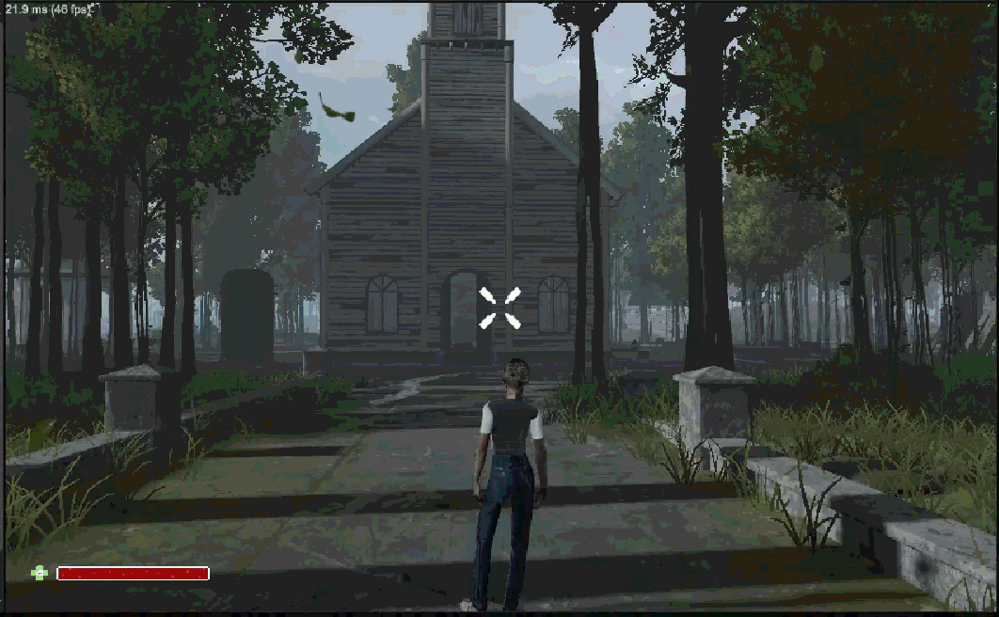
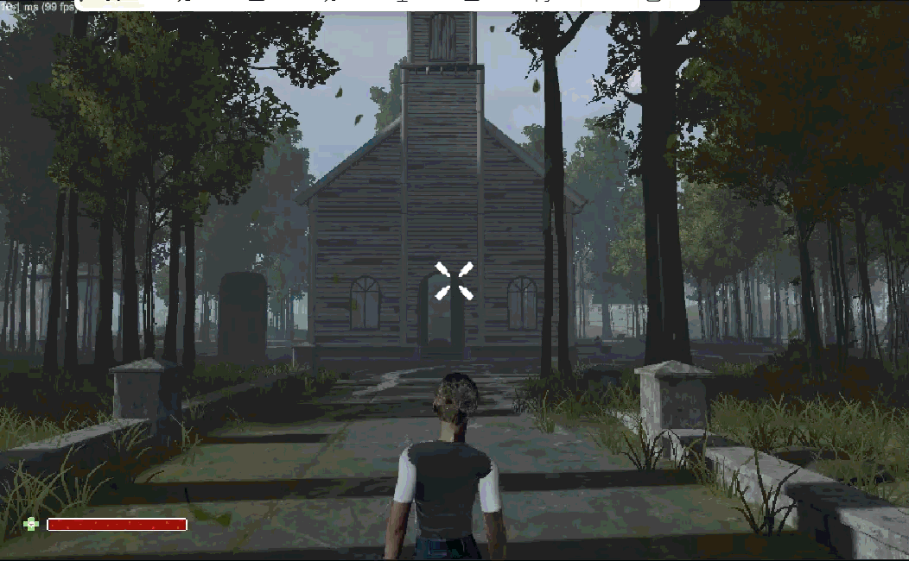

# **移动**
- 在Unity中，实现游戏对象的移动主要分为：
  - 普通的坐标移动，即直接修改物品的坐标值；
  - 使用Rigidbody/Rigidbody2D组件实现物理上的受力位移，同时游戏对象可受重力影响或实现碰撞；
  - 使用角色控制器，该方法专门用于第一人称或第三人称3D角色的移动，自带胶囊碰撞检测，更适合处理上下台阶、斜坡滑落等角色特有的移动需求

> Tips: 下面的代码均使用旧版Input Manager，若使用新版Input System，旧API可能不可用，若二者同时使用可能会导致两套输入冲突产生移动方向混乱、颠倒。可在Edit -> Project Settings -> Player → Other Settings -> Input Handling处修改

- [**移动**](#移动)
  - [**直接修改坐标**](#直接修改坐标)
  - [**使用Rigidbody/Rigidbody2D**](#使用rigidbodyrigidbody2d)
  - [**使用角色控制器**](#使用角色控制器)
  - [**角色朝向修改**](#角色朝向修改)


## **直接修改坐标**

- 该方法更适合UI使用，因为不涉及物理碰撞，会存在穿墙现象

<div align="center">
  
</div>

``` csharp
using UnityEngine;

// 假设实现移动的脚本名为TransformMove
public class TransformMove : MonoBehaviour
{
    public float moveSpeed = 1f;
    
    void Update() {
      // 水平输入
      float h = Input.GetAxis("Horizontal");
      // 垂直输入
      float v = Input.GetAxis("Vertical");

      Vector3 dir = new Vector3(h, 0, v);

      // transform.position += dir * moveSpeed * Time.deltaTime;
      transform.Translate(dir * moveSpeed * Time.deltaTime, Space.World);
    }
}

```

## **使用Rigidbody/Rigidbody2D**

- 使用该方法需要挂载Rigidbody/Rigidbody2D组件；
- 该方法适合用于玩家角色或车辆等需要物理系统的对象，可正常计算碰撞，但需将移动代码写在FixedUpdate中。

<div align="center">
  
</div>

``` csharp
using UnityEngine;

public class RigidbodyMove : MonoBehaviour
{
  public float moveForce = 1f;
  public Rigidbody rb;

  void Start() {
    if (rb == null) {
      rb = GetComponent<Rigidbody>();
    }
  }

  void FixedUpdate() {
    float h = Input.GetAxis("Horizontal");
    float v = Input.GetAxis("Vertical");
    Vector3 dir = new Vector3(h, 0, v).normalized;

    // Acceleration: 忽略质量加速 Force: 持续力 Impulse: 瞬间冲击力
    rb.AddForce(dir * moveForce, ForceMode.Acceleration);
    // Vector3 tar = rb.position + dir * moveForce * Time.fixedDeltaTime;
    // rb.MovePosition(tar);
  }

}

```

- Rigidbody2D移动方法与Rigidbody略有差别

``` csharp
using UnityEngine;

public class Rigidbody2DMove : MonoBehaviour
{
  public float moveForce = 1f;
  public Rigidbody2D rb;

  void Start() {
    if (rb == null) {
      rb = GetComponent<Rigidbody2D>();
    }
  }

  void FixedUpdate() {
    float h = Input.GetAxis("Horizontal");

    rb.velocity = new Vector2(h * moveForce, rb.velocity.y);
    // rb.AddForce(Vector2.right * h * moveForce);
  }

}

```

## **使用角色控制器**

- 使用该方法需挂载CharacterController，同样能够实现碰撞；
- 由于无需挂载Rigidbody/Rigidbody2D，因此需要额外实现重力，这里只演示水平移动，重力需另行实现。

<div align="center">
  
</div>

``` csharp
using UnityEngine;

public class CharacterControllerMove : MonoBehaviour
{
  public float moveSpeed = 1f;
  public CharacterController Cc;

  void Start() {
    if (Cc == null) {
      Cc = GetComponent<CharacterController>();
    }
  }

  void Update() {
    float h = Input.GetAxis("Horizontal");
    float v = Input.GetAxis("Vertical");
    Vector3 move = transform.right * h + transform.forward * v;

    Cc.Move(move.normalized * moveSpeed * Time.deltaTime);
  }
}


```

## **角色朝向修改**

``` csharp

    private void RotateTowardsMovement(Vector3 dir)
    {
        if (dir != Vector3.zero)
        {
            Quaternion target = Quaternion.LookRotation(dir);

            transform.rotation = Quaternion.Slerp(
                transform.rotation,
                target,
                turnSpeed * Time.deltaTime
                );
        }
    }

```

[返回](../README.md)